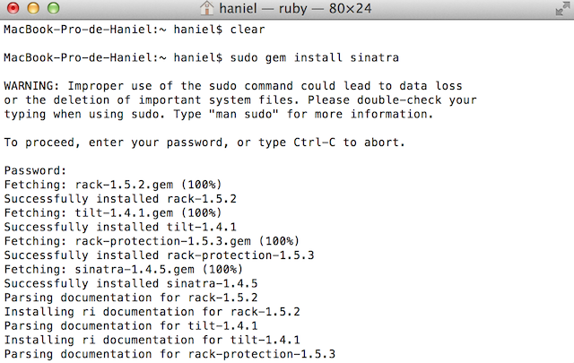
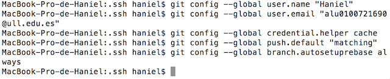

#**Tarea Inicial**

### 1. Instalacion de *rbenv*

- Lo primero que debemos tener es *brew*, escribiendo *"ruby -e "$(curl -fsSL https://raw.github.com/Homebrew/homebrew/go/install)""* lo instalaremos.

- Luego instalamos rbenv : "brew install rbenv ruby-build"

### 2. Instalacion de Ruby 2.1.2

- El comando para descargar e instalar ruby es : *"rbenv install 2.1.2"*

- Y la forma de establecerlo por defecto es : *"rbenv global 2.1.2"*
- Finalmente, comprobamos que tengamos la version: *"ruby -v"*

### 3. Instalacion de la gemas

 Para la instalacion de la gema de tweeter solamente es necesario introducir: *"gem install tweeter"* y para sinatra: *"gem install sinatra"*
 

### 4. Instalacion y configuracion de git

En el directorio *rsa* encontraremos la clave *id_rsa.pub*, sino la tuvieramos tendriamos que generar un par de claves de publicas usando el comando: *”ssh-keygen”*.

Esta clave la copiamos y la introducimos en Github en *ajustes -> SSH Keys*

La configuracion personal de nuestra cuenta sera como la de la imagen siguiente.

Para asegurarnos de una configuracion correcta ejecutaremos: *"git config --list"*

